# Diagrama de Flujo: Checklist de Despegue

## Flujo Completo (Mermaid)

```mermaid
flowchart TD
    A([Piloto abre Mision]) --> B{Mision tiene<br/>drone asignado?}
    B -- No --> B1[Seleccionar drone<br/>de la flota]
    B1 --> B
    B -- Si --> C{Drone >=200g<br/>registrado en<br/>Aerocivil?}
    C -- No / Vencido --> C1[ERROR: Mostrar<br/>requisito de<br/>matricula Aerocivil]
    C1 --> STOP1([BLOQUEADO])
    C -- Si / Exento <200g --> D{Certificado de<br/>piloto UAEAC<br/>vigente?}
    D -- No / Vencido --> D1[ERROR: Certificado<br/>vencido. Renovar<br/>y cargar nuevo]
    D1 --> STOP2([BLOQUEADO])
    D -- Si --> E{Poliza RC<br/>Extracontractual<br/>vigente?}
    E -- No / Vencida --> E1[ERROR: Poliza<br/>vencida. Cargar<br/>nueva poliza]
    E1 --> STOP3([BLOQUEADO])
    E -- Si --> F[/"INICIAR MODULO<br/>PRE-VUELO LEGAL"/]

    F --> G[Obtener posicion<br/>GPS actual]
    G --> H{Dentro de 5km<br/>de aeropuerto o<br/>zona restringida?}
    H -- Si --> H1{Tiene autorizacion<br/>de Aerocivil?}
    H1 -- No --> H2[ALERTA: Espacio<br/>aereo restringido.<br/>Solicitar<br/>autorizacion]
    H2 --> STOP4([BLOQUEADO])
    H1 -- Si --> I
    H -- No --> I[Consultar datos<br/>meteorologicos API]

    I --> J{Viento > 40 km/h<br/>O visibilidad POBRE<br/>O tormenta activa?}
    J -- Si --> J1[ADVERTENCIA:<br/>Condiciones<br/>meteorologicas<br/>adversas]
    J1 -- Cancelar --> STOP5([MISION CANCELADA])
    J1 -- Aceptar riesgo --> K
    J -- No --> K[Consultar NOTAMs<br/>activos en la zona]

    K --> L{NOTAMs activos<br/>afectan la zona?}
    L -- Si --> L1[Mostrar NOTAMs.<br/>Piloto revisa<br/>y confirma]
    L1 --> M
    L -- No --> M[/"VERIFICACION LEGAL<br/>APROBADA - Iniciar<br/>Protocolo de Seguridad"/]

    M --> N["FASE 1: CHECKLIST<br/>PRE-ARMADO"]
    N --> N1["[ ] Fuselaje sin danos visibles"]
    N1 --> N2["[ ] Brazos desplegados y asegurados"]
    N2 --> N3["[ ] Helices sin grietas - CW/CCW correcto"]
    N3 --> N4["[ ] Helices ajustadas firmemente"]
    N4 --> N5["[ ] Motores giran libremente"]
    N5 --> N6["[ ] Bateria de vuelo >= 80%"]
    N6 --> N7["[ ] Bateria insertada y asegurada"]
    N7 --> N8["[ ] Tren de aterrizaje en posicion"]
    N8 --> NA{Todos los items<br/>criticos marcados?}
    NA -- No --> NA1[Items faltantes<br/>resaltados en ROJO.<br/>No puede continuar]
    NA1 --> N1
    NA -- Si --> O

    O --> O0["FASE 2: CHECKLIST<br/>CONFIGURACION"]
    O0 --> O1["[ ] Control remoto enlazado"]
    O1 --> O2["[ ] Bateria control >= 80%"]
    O2 --> O3["[ ] App de vuelo conectada"]
    O3 --> O4["[ ] GPS >= 8 satelites"]
    O4 --> O5["[ ] Compass calibrado"]
    O5 --> O6["[ ] IMU calibrada"]
    O6 --> O7["[ ] RTH altitud configurada 50-120m"]
    O7 --> O8["[ ] Geofence activado"]
    O8 --> O9["[ ] Failsafe: RTH en perdida de senal"]
    O9 --> O10["[ ] Limite 123m AGL configurado"]
    O10 --> OA{Todos los items<br/>criticos marcados?}
    OA -- No --> OA1[Items faltantes<br/>resaltados en ROJO]
    OA1 --> O1
    OA -- Si --> P

    P --> P0["FASE 3: CHECKLIST<br/>PRE-DESPEGUE"]
    P0 --> P1["[ ] Area despejada 3m radio"]
    P1 --> P2["[ ] Observadores en posicion"]
    P2 --> P3["[ ] Sin personas no autorizadas"]
    P3 --> P4["[ ] Viento verificado in-situ"]
    P4 --> P5["[ ] Punto aterrizaje emergencia identificado"]
    P5 --> P6["[ ] Altitud max recordada: 123m AGL"]
    P6 --> P7["[ ] Distancia max recordada: 500m VLOS"]
    P7 --> P8["[ ] GPS >= 12 satelites"]
    P8 --> P9["[ ] Enlace de video estable"]
    P9 --> P10["[ ] Motores arrancan correctamente"]
    P10 --> P11["[ ] Hover test 2m - aeronave estable"]
    P11 --> PA{Todos los items<br/>criticos marcados?}
    PA -- No --> PA1[No puede despegar.<br/>Resolver problemas]
    PA1 --> P1
    PA -- Si --> Q

    Q[Registrar timestamp<br/>de completacion +<br/>firma del piloto] --> R[/"TODOS LOS CHECKLISTS<br/>APROBADOS - LISTO<br/>PARA DESPEGUE"/]

    R --> S[Crear flight_log:<br/>Hora despegue,<br/>posicion GPS,<br/>snapshot clima]
    S --> T[Iniciar grabacion<br/>telemetria cada 2s]
    T --> U[Activar BOTON DE<br/>EMERGENCIA flotante]
    U --> V([EN VUELO])

    style STOP1 fill:#d32f2f,color:#fff
    style STOP2 fill:#d32f2f,color:#fff
    style STOP3 fill:#d32f2f,color:#fff
    style STOP4 fill:#d32f2f,color:#fff
    style STOP5 fill:#ff9800,color:#000
    style V fill:#2e7d32,color:#fff
    style M fill:#1565c0,color:#fff
    style R fill:#2e7d32,color:#fff
```

## Resumen de Puertas de Seguridad (Gates)

| Gate | Tipo | Descripcion | Accion si falla |
|------|------|-------------|-----------------|
| **Gate 1: Documentos** | Hard Block | Matricula drone, certificado piloto UAEAC, poliza RC | No puede continuar |
| **Gate 2: Espacio Aereo** | Hard Block | Verificacion geofence (5km aeropuertos, bases militares, carceles, gobierno) | No puede continuar sin autorizacion |
| **Gate 3: Clima** | Soft Block | Viento >40km/h, visibilidad pobre, tormentas | Piloto puede aceptar riesgo |
| **Gate 4: Pre-Armado** | Hard Block | 8 items criticos de inspeccion fisica | No puede avanzar a siguiente fase |
| **Gate 5: Configuracion** | Hard Block | 10 items criticos de enlace y configuracion | No puede avanzar a siguiente fase |
| **Gate 6: Pre-Despegue** | Hard Block | 11 items criticos de verificacion de zona y despegue | No puede despegar |

## Datos Registrados Automaticamente

Al completar todo el flujo exitosamente, la app registra automaticamente:
- **flight_log**: Hora de despegue, posicion GPS, condiciones meteorologicas, tipo de operacion
- **checklist_executions**: Timestamp de cada fase completada con items individuales
- **telemetry_points**: Posicion GPS + altitud + velocidad + bateria cada 2 segundos
- **weather_snapshot**: Condiciones completas al momento del despegue
